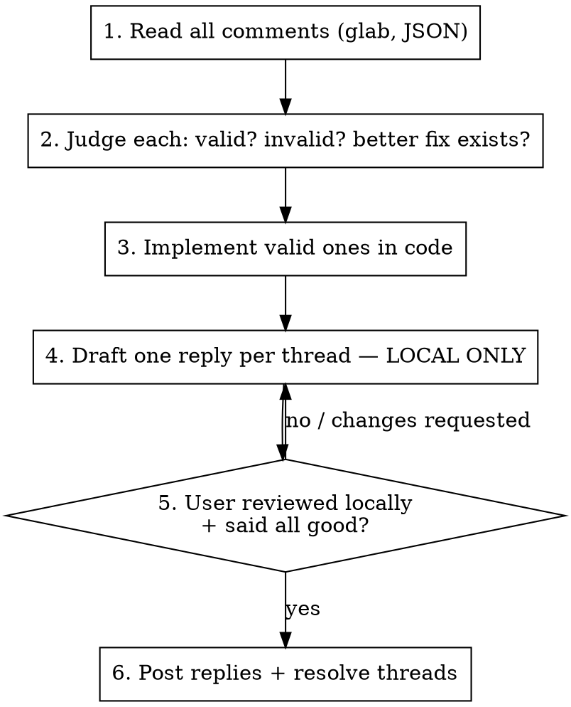

# Addressing GitLab MR Comments

## Overview

Work through every reviewer comment on a GitLab MR: read it, **decide whether it is actually right**, implement the valid ones (or a better fix), and reply on each thread — but **draft replies locally and post nothing until the user has reviewed and said all good.**

Two failures this skill exists to prevent:

1. **Rubber-stamping** — agreeing with a comment and "fixing" it because a reviewer said so, even when the comment is wrong or the code is already correct.
2. **Premature posting** — running `glab mr note create` or `glab mr note resolve` before the user has seen the changes and replies locally.

**Reviewer authority is not correctness.** A senior reviewer can be wrong. Verify against the actual code every time.

## The Iron Rule

**No `glab` write command (`note create`, `note resolve`) runs until the user has reviewed locally and explicitly said all good.**

Reading is fine anytime (`note list`, `mr view`, `mr diff`). Writing waits for the gate. No exceptions:
- Not "the reply is obviously fine"
- Not "the user is clearly going to approve"
- Not "I'll post as I go to save a step"
- Not "just this one resolve"

## Workflow



### 1. Read the comments

Extract the MR IID (number after `/-/merge_requests/`) and the project from the URL. Then list discussions as JSON:

```bash
glab mr note list <IID> -R <project-url> -F json
```

- Each element is a discussion with `.id` (the discussion ID, used for reply + resolve) and `.notes[]`.
- **Skip `.notes[].system == true`** — those are automated events ("changed the milestone"), not review feedback.
- Note which discussions are already resolved; don't reopen settled threads.
- Get the authenticated user (whose voice you reply in): `glab api /user --jq '.username'`.

### 2. Judge each comment — do NOT default to agree

For every comment, read the code it points at and decide:
- **Valid** — the code has the problem described. Fix it.
- **Valid, but there's a better fix** — implement the better approach, and the reply explains why.
- **Invalid** — the comment is wrong (misreads the code, suggests a change that breaks it, targets a non-issue, or is based on a false premise). Do NOT change the code. The reply explains, concretely, why it is not valid.

When unsure whether a comment is valid, investigate the code — don't guess and don't agree to be safe. If it's a genuine judgment call, present it to the user rather than silently picking.

**REQUIRED BACKGROUND:** superpowers:receiving-code-review — for how to engage feedback with technical rigor instead of performative agreement.

### 3. Implement the valid ones

Make the code changes. Follow the project's conventions and skills (this repo's CLAUDE.md and `.ai/rules`). Run the affected tests.

### 4. Draft replies locally — post nothing

Write one reply per thread into a local scratch file (e.g. the scratchpad dir), a table mapping `discussion.id` → reply text. Reply content:
- **Valid / better fix** → what you changed, briefly and specifically (file, what and why).
- **Invalid** → why it is not valid, with the concrete reason.

Every non-system, unresolved discussion gets exactly one reply. Match the reply to what actually happened — never claim a fix you didn't make.

### 5. Gate — hand to the user

Tell the user: changes are made locally and replies are drafted (show them). Ask them to review the diff and the drafted replies **locally first**, then ask a clear yes/no: **"All good to post the replies and resolve the threads?"** Then stop and wait.

If they request changes, loop back to step 2/3/4. Do not post.

### 6. Post and resolve — only after "all good"

For each thread, post the reply, then resolve:

```bash
glab mr note create <IID> -R <project-url> --reply <DISCUSSION_ID> -m "<reply text>"
glab mr note resolve <DISCUSSION_ID> <IID> -R <project-url>
```

Post replies to every thread. Resolve per the user's instruction (default: resolve all addressed threads). If the user wants a disputed/invalid thread left open for the reviewer, honor that instead. Report what was posted and resolved.

## glab command reference

| Need | Command |
| --- | --- |
| Authenticated user | `glab api /user --jq '.username'` |
| List discussions (JSON) | `glab mr note list <IID> -R <repo> -F json` |
| View MR + comments | `glab mr view <IID> -R <repo> --comments` |
| View the diff | `glab mr diff <IID> -R <repo>` |
| Reply to a thread | `glab mr note create <IID> -R <repo> --reply <DISCUSSION_ID> -m "..."` |
| Resolve a thread | `glab mr note resolve <DISCUSSION_ID> <IID> -R <repo>` |

`-R <repo>` accepts the full project URL or `GROUP/NAMESPACE/PROJECT`. Reply/resolve need the **discussion** `.id`, not a note id. `--reply` accepts a unique prefix of ≥8 chars.

## Red flags — STOP

Any of these means you are about to violate the skill:

- About to run `glab mr note create` / `note resolve` before the user said all good
- "The reviewer is senior, so the comment must be right"
- "I'll agree and fix it to get the MR merged faster"
- Changing code for a comment you haven't verified against the actual code
- A reply that claims a fix you didn't make, or that thanks-and-agrees without saying what changed
- Resolving threads the user hasn't approved posting on
- Posting replies "as I go" instead of after one review gate

## Rationalization table

| Excuse | Reality |
| --- | --- |
| "Reviewer said so, just do it" | Reviewers are wrong sometimes. Verify against the code. |
| "Agreeing is faster / friendlier" | A wrong fix costs more (broken code, re-review) than a correct pushback. |
| "The user will obviously approve" | Then it costs nothing to wait for them to say so. Gate is mandatory. |
| "I'll post replies as I finish each" | Batch behind one review gate. No writes before approval. |
| "The comment is invalid so I'll just skip it" | Invalid comments still get a reply explaining why. Every thread gets one. |
| "Resolve everything to close it out" | Only after the user approves; honor requests to leave disputed threads open. |
